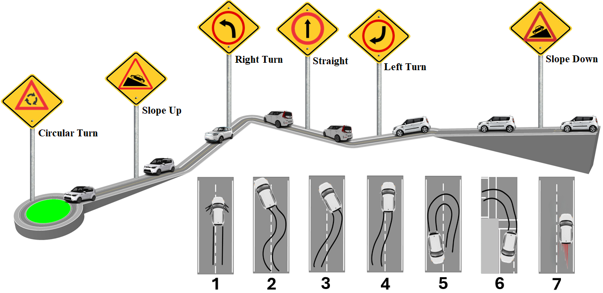
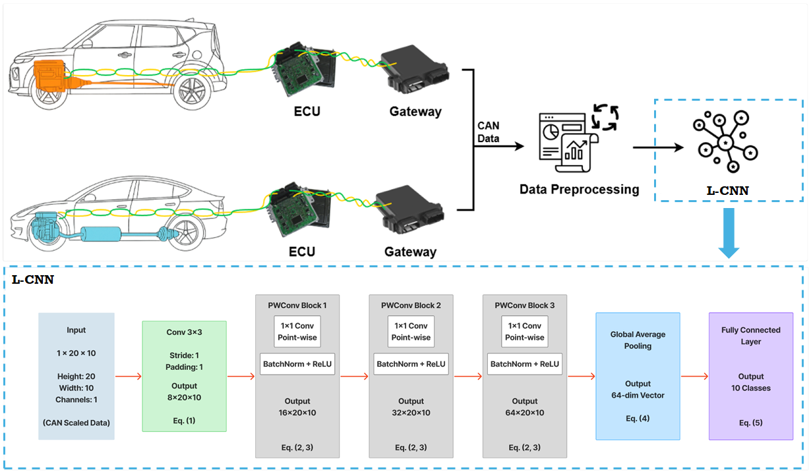

# 🚗 Unified IVN Safety & Security: Real-Time Detection of Aggressive Driving and Cyber-Attacks

[](https://www.python.org/downloads/)
[](https://pytorch.org/)
[](LICENSE)
[](https://www.raspberrypi.org/)
[](https://en.wikipedia.org/wiki/CAN_bus)

A unified deep learning system for real-time detection of aggressive driving behaviors and cyber-attacks in vehicle networks using lightweight CNN architecture optimized for edge deployment.


## 🎯 Abstract

This project implements a **Safety-Critical Cybersecurity** system that unifies vehicle safety and security by detecting both aggressive driving behaviors and cyber-attacks through Controller Area Network (CAN) data analysis. The system achieves:

- **99% overall accuracy** across multiple vehicle types
- **20ms detection time** (3× faster than prior work)
- **Minimal preprocessing** with only 6 CAN features
- **Edge deployment** on Raspberry Pi 4 with 3.3K parameters

The approach distinguishes between driver-induced aggression and attack-triggered behaviors, operating entirely on CAN data without external sensors.

### Detected Behaviors:
- **Aggressive Driving**: Abrupt Braking (AB), Abrupt Lane Change (AL), Abrupt Acceleration (AA)
- **Cyber-Attacks**: DoS, Fuzzing, Replay, Behavior-aware Situational Replay (AAB, AAL, AAA)

---

## ✨ Key Features

### 🔬 Technical Innovations
- **Lightweight L-CNN Architecture**: Only 3,333 parameters for real-time inference
- **Unified Detection Framework**: Single model for both safety and security
- **Minimal Feature Extraction**: 6 CAN features (Speed, RPM, Brake, Gear, Ultrasonic, High-Priority ID)
- **Cross-Vehicle Validation**: Tested on both ICEV (Kia) and BEV (Tesla)
- **Autonomous Driving Compatible**: Validates control commands in self-driving scenarios

### ⚡ Performance Advantages
- **Detection Time**: 20ms with 50% overlap (vs 5000ms in prior work)
- **Memory Efficiency**: 112KB (vs 10.2MB for comparable CNNs)
- **Preprocessing**: 29ms (vs 171ms for image-based methods)
- **Inference Speed**: 43ms on Raspberry Pi 4

---

## 📊 Dataset Overview

### Data Collection Environments

#### Controlled Environment (Fig. 1)

*Data collection in restricted environment with predefined aggressive driving patterns*

**Test Scenarios**:
1. Abrupt Braking zones
2-6. Lane change maneuvers
7. Acceleration tests

### Vehicle Specifications

| Vehicle Type | Model | Drivers | Scenarios | Control Mode |
|-------------|-------|---------|-----------|--------------|
| **ICEV** | Kia Soul | 16 (12M, 4F) | Controlled + Real-world | Manual |
| **BEV** | Tesla Model 3 | 6 (4M, 2F) | Urban, City, Highway | Manual + Autonomous |

### Dataset Composition

#### Kia (ICEV) Manual Driving
| Class | Frames | Duration (sec) | Description |
|-------|--------|----------------|-------------|
| Safe & Attack-Free (S&AF) | 17,826,000 | 9,000 | Normal driving |
| Abrupt Brake (AB) | 1,415,000 | 700 | Sudden braking |
| Abrupt Lane Change (AL) | 1,798,000 | 900 | Aggressive lane shifts |
| Abrupt Acceleration (AA) | 1,349,000 | 700 | Rapid acceleration |
| DoS Attack | 16,000 | 80 | High-priority flooding |
| Fuzzing Attack | 140,000 | 150 | Random message injection |
| Replay Attack | 155,000 | 150 | Message retransmission |
| AAB (Attack-Brake) | 100,000 | 180 | Situational replay |
| AAL (Attack-Lane) | 100,000 | 180 | Situational replay |
| AAA (Attack-Accel) | 100,000 | 180 | Situational replay |

#### Tesla (BEV) Manual Driving
| Class | Frames | Duration (sec) |
|-------|--------|----------------|
| S&AF | 600,000 | 200 |
| AB | 220,000 | 75 |
| AL | 900,000 | 300 |
| AA | 164,000 | 60 |
| DoS/Fuzz/Replay | 100,000 each | 200 each |
| AAB/AAL/AAA | ~91,000 each | 200 each |

#### Tesla Autonomous Driving
| Class | Frames | Duration (sec) |
|-------|--------|----------------|
| S&AF | 820,000 | 270 |
| Attack Classes | 37,000-61,500 | 135 each |

---

## 🧠 Model Architecture

### L-CNN Architecture Flow

*End-to-end pipeline from CAN signal acquisition to behavior classification*

### Architecture Details

**Input**: 1×20×10 tensor (20 time steps, 10 features including CAN ID, 8 payload bytes, time delta)

**Network Structure**:
```
Conv2D(3×3, 1→8) → BN → ReLU
├─ PointwiseConv(1×1, 8→16) → BN → ReLU
├─ PointwiseConv(1×1, 16→32) → BN → ReLU
└─ PointwiseConv(1×1, 32→64) → BN → ReLU
   → GlobalAvgPool(64×20×10 → 64)
   → FC(64→10) → Softmax
```

**Key Design Principles**:
- Progressive channel expansion (8→16→32→64)
- Pointwise convolutions for efficient cross-channel mixing
- Global average pooling prevents overfitting
- Minimal parameters for edge deployment


### CAN Feature Engineering

| Feature | CAN ID | Purpose | Update Rate |
|---------|--------|---------|-------------|
| Speed | Vehicle-specific | Primary behavior indicator | ~100Hz |
| RPM | Vehicle-specific | Engine state tracking | ~100Hz |
| Brake | Vehicle-specific | Deceleration detection | ~100Hz |
| Gear | Vehicle-specific | Transmission state | ~100Hz |
| Ultrasonic | Vehicle-specific | Low-speed context (parking) | Variable |
| High-Priority Multi | 0x000-0x100 | Timing-based intrusion detection | 5Hz (Kia), 6.25Hz (Tesla) |

---

## 📈 Experimental Results

### Overall Performance Comparison

| Model | Dataset | Accuracy | Detection Time | Memory | Parameters |
|-------|---------|----------|----------------|--------|------------|
| **L-CNN** | Kia Manual | **99.45%** | 20ms | 112KB | 3.3K |
| GRU | Kia Manual | 97.82% | 20ms | - | 26.9K |
| **L-CNN** | Tesla Manual | **98.67%** | 20ms | 112KB | 3.3K |
| GRU | Tesla Manual | 91.23% | 20ms | - | 26.9K |
| **L-CNN** | Tesla Auto | **99.12%** | 20ms | 112KB | 3.3K |
| GRU | Tesla Auto | 98.45% | 20ms | - | 26.9K |

### Detailed Class-wise Performance (L-CNN)

#### Kia Manual Driving
| Class | Precision | Recall | F1-Score | Support |
|-------|-----------|--------|----------|---------|
| S&AF | 0.9994 | 0.9999 | 0.9996 | 1,782,600 |
| AB | 0.9767 | 0.9972 | 0.9868 | 141,500 |
| AL | 0.9989 | 0.9950 | 0.9970 | 179,800 |
| AA | 0.9972 | 0.9743 | 0.9856 | 134,900 |
| DoS | 0.9882 | 1.0000 | 0.9941 | 1,600 |
| Fuzz | 1.0000 | 0.9991 | 0.9995 | 14,000 |
| Replay | 1.0000 | 0.9993 | 0.9997 | 15,500 |
| AAB | 0.9897 | 0.9948 | 0.9922 | 10,000 |
| AAL | 1.0000 | 0.9946 | 0.9973 | 10,000 |
| AAA | 0.9838 | 0.9930 | 0.9884 | 10,000 |

#### Tesla Manual Driving
| Class | Precision | Recall | F1-Score | Support |
|-------|-----------|--------|----------|---------|
| S&AF | 0.9986 | 0.9952 | 0.9969 | 60,000 |
| AB | 0.9967 | 0.9297 | 0.9620 | 22,000 |
| AL | 0.9915 | 1.0000 | 0.9957 | 90,000 |
| AA | 0.9627 | 0.9789 | 0.9707 | 16,400 |
| DoS | 0.9993 | 0.9538 | 0.9760 | 10,000 |
| Fuzz | 0.9976 | 1.0000 | 0.9988 | 10,000 |
| Replay | 0.9608 | 0.9780 | 0.9693 | 10,000 |

#### Tesla Autonomous Driving
| Class | Precision | Recall | F1-Score | Support |
|-------|-----------|--------|----------|---------|
| S&AF | 1.0000 | 1.0000 | 1.0000 | 82,000 |
| DoS | 0.9941 | 0.9492 | 0.9712 | 5,000 |
| Fuzz | 1.0000 | 1.0000 | 1.0000 | 6,150 |
| Replay | 0.9568 | 0.9950 | 0.9755 | 5,000 |
| AAB | 0.9967 | 0.9760 | 0.9863 | 3,700 |
| AAL | 0.9972 | 0.9972 | 0.9972 | 1,400 |
| AAA | 0.9786 | 0.9971 | 0.9878 | 4,000 |

### Key Findings

**L-CNN Advantages**:
- ✅ **3× faster detection** than prior CNN approaches (20ms vs 60ms+)
- ✅ **8× fewer parameters** than comparable GRU (3.3K vs 26.9K)
- ✅ **90× less memory** than image-based CNNs (112KB vs 10.2MB)
- ✅ **Superior replay attack detection**: 96.93% vs 63.12% (GRU on Tesla Manual)
- ✅ **Better acceleration recognition**: 97.07% vs 56.89% (GRU on Tesla Manual)
- ✅ **Consistent cross-vehicle performance**: 98-99% across all datasets

**GRU Weaknesses**:
- ❌ Struggles with temporal replay patterns (52.52% recall on Tesla Manual Replay)
- ❌ Confuses AA with AB (misclassifies 58.65% of AA samples on Tesla Manual)
- ❌ Poor DoS detection on Tesla Manual (70.69% F1 vs 97.60% L-CNN)

---

## 🚀 Installation

### Prerequisites
```bash
Python >= 3.8
PyTorch >= 2.0
CUDA >= 11.0 (optional, for GPU training)
```

### Setup

1. **Clone the repository**
```bash
git clone https://github.com/Arupreza/UISS.git
cd UISS
```

2. **Create virtual environment**
```bash
python -m venv venv
source venv/bin/activate  # On Windows: venv\Scripts\activate
```

3. **Install dependencies**
```bash
pip install -r requirements.txt
```

4. **Verify installation**
```bash
python -c "import torch; print(f'PyTorch: {torch.__version__}')"
```

---

## 💻 Usage

### Training

#### ICEV (Kia) Manual Driving
```bash
python ICEV_Manual_L_CNN.ipynb
```

#### BEV (Tesla) Manual Driving
```bash
python BEV_Manual_L_CNN.ipynb
```

#### BEV (Tesla) Autonomous Driving
```bash
python BEV_Auto_L_CNN.ipynb
```

### Inference on Raspberry Pi 4

```python
from models.lcnn import LCNN
import torch
import numpy as np

# Load trained model
model = LCNN(num_classes=10)
model.load_state_dict(torch.load('models/lcnn_kia_manual.pth'))
model.eval()

# Prepare input (20 timesteps, 10 features)
can_data = np.random.rand(1, 20, 10)  # Replace with real CAN data
input_tensor = torch.FloatTensor(can_data)

# Inference
with torch.no_grad():
    output = model(input_tensor)
    prediction = torch.argmax(output, dim=1)
    
print(f"Detected behavior: {class_names[prediction]}")
```

### Real-Time CAN Data Processing

```python
import can
from preprocessing import preprocess_can_frame

# Initialize CAN interface
bus = can.interface.Bus(channel='can0', bustype='socketcan')

buffer = []
for msg in bus:
    # Filter relevant CAN IDs
    if msg.arbitration_id in [SPEED_ID, RPM_ID, BRAKE_ID, GEAR_ID]:
        processed = preprocess_can_frame(msg)
        buffer.append(processed)
        
        # Run inference every 20 frames (20ms chunks)
        if len(buffer) >= 20:
            prediction = model.predict(buffer[-20:])
            print(f"Behavior: {prediction}")
            buffer = buffer[10:]  # 50% overlap
```

---

## 📁 Repository Structure

```
unified-ivn-safety-security/
├── UISS/                          # Aggressive Driving Detection System
│   ├── .gitignore
│   ├── BEV_Auto_GRU.ipynb          # Tesla Autonomous - GRU baseline
│   ├── BEV_Auto_L_CNN.ipynb        # Tesla Autonomous - L-CNN
│   ├── BEV_Manual_GRU.ipynb        # Tesla Manual - GRU baseline
│   ├── BEV_Manual_L_CNN.ipynb      # Tesla Manual - L-CNN
│   ├── Data Labeling.ipynb         # Dataset annotation pipeline
│   ├── ICEV_GRU.ipynb              # Kia Manual - GRU baseline
│   ├── ICEV_L_CNN.ipynb            # Kia Manual - L-CNN
│   ├── LICENSE
│   └── README.md                    # This file
│
├── docs/
│   ├── images/                      # Figures and diagrams
│   │   ├── controlled_environment_route.png
│   │   ├── lcnn_architecture_flow.png
│   │ 
│   └── paper.pdf                    # Associated research paper
│
│
├── models/
│   ├── BEV_Auto_GRU.pth            # Trained weights
│   ├── BEV_Auto_L_CNN.pth          # Trained weights
│   ├── BEV_Manual_GRU.pth          # Trained weights
│   ├── BEV_Manual_L_CNN.pth        # Trained weights
│   ├── ICEV_GRU.pth                # Trained weights
│   ├── ICEV_L_CNN.pth              # Trained weights
│
├── requirements.txt
```

---

---

## 📄 License

This project is licensed under the MIT License - see the [LICENSE](LICENSE) file for details.


## 📧 Contact

- **Md Rezanur Islam** - arupreza@sch.ac.kr

**Soonchunhyang University**  
Department of Software Convergence & Information Security Engineering  
Asan-si, South Korea


**Keywords**: Aggressive Driving Detection, Cybersecurity, In-Vehicle Network, CAN Bus, Deep Learning, L-CNN, Edge Computing, Autonomous Driving, V2X Security